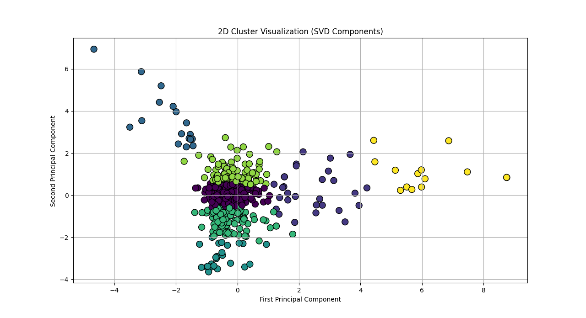
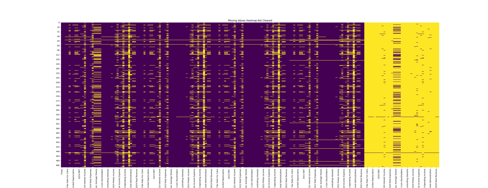
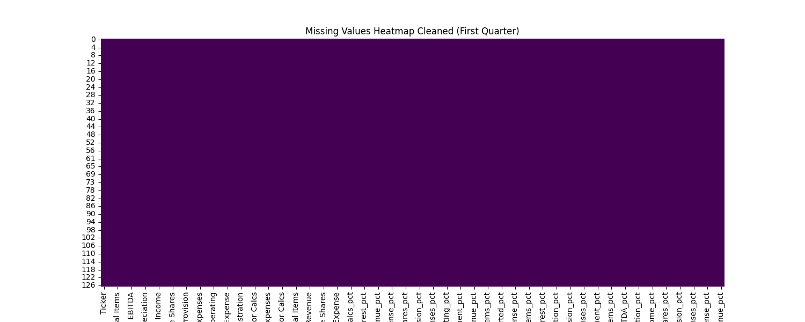
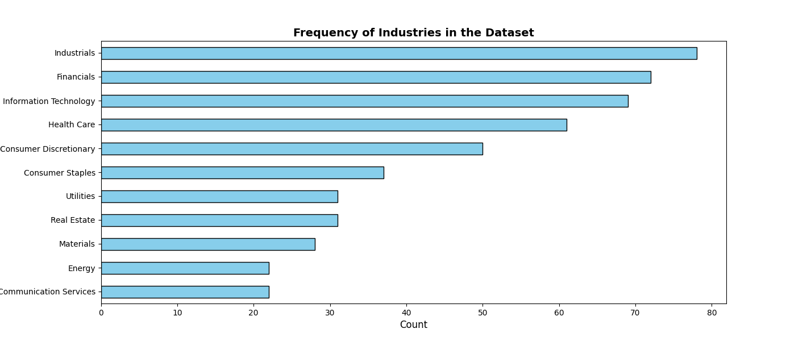
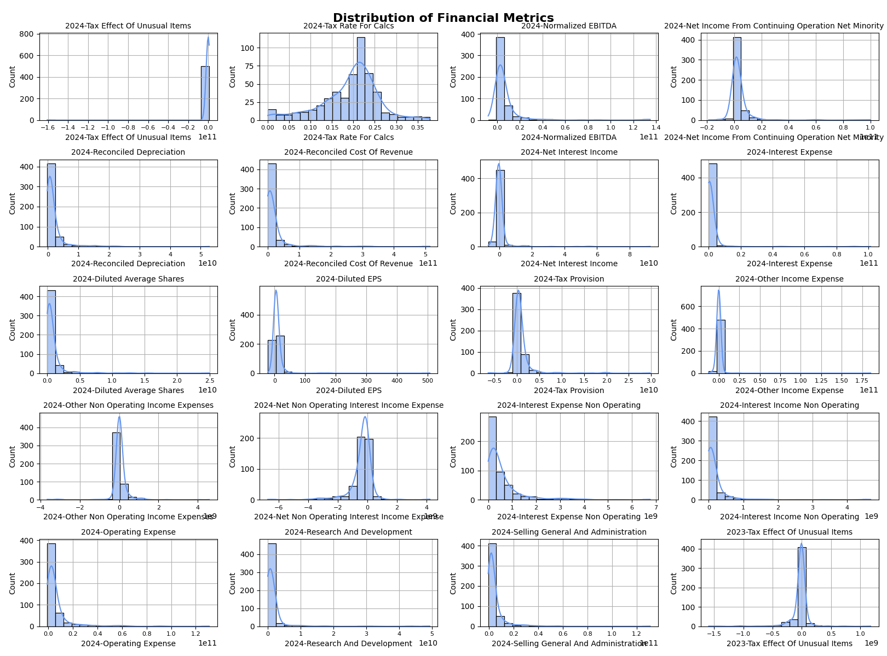
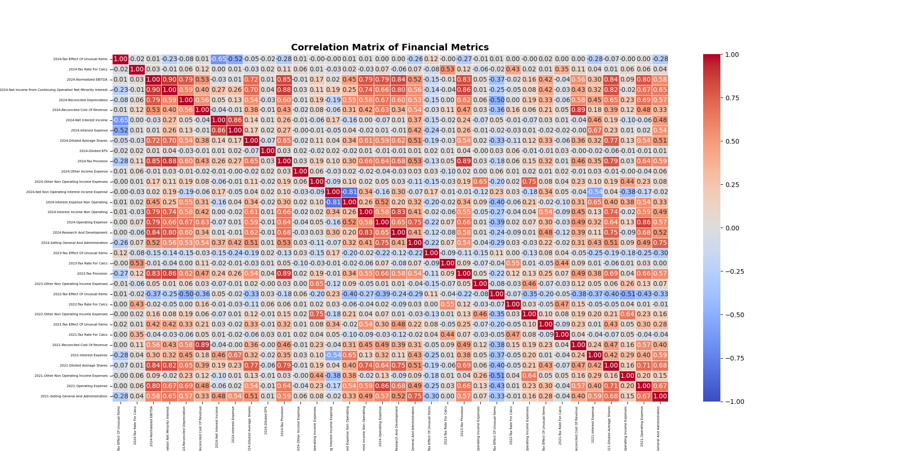
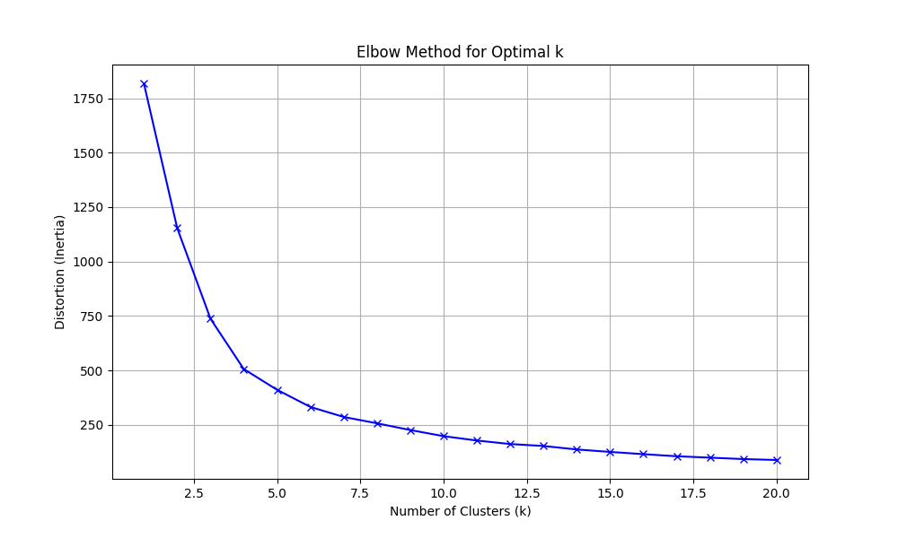
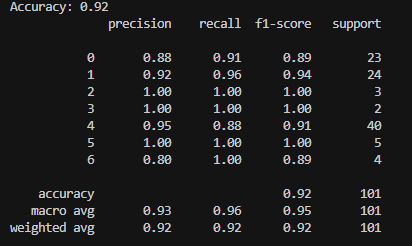
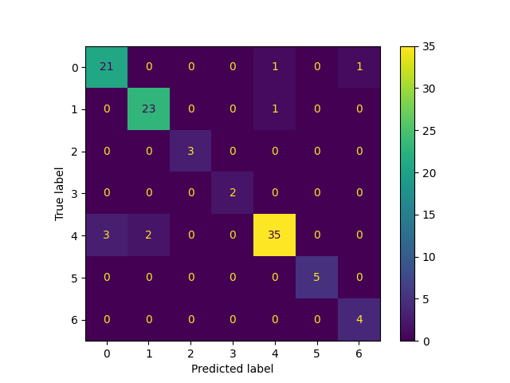

# Unsupervised Learning Stock Classifier

**Clustering and Classification Pipeline for S&P 500 Financial Data**  
By Josué Dazogbo and Racine Kane, Engineering Students at the University of Ottawa  
Date: 24 March 2025

## 📊 Overview

This project implements an unsupervised learning pipeline to **cluster S&P 500 companies** based on their **financial attributes** using **k-Means clustering**, followed by a **supervised model** that classifies new companies into those clusters.

We scrape financial data using **Yahoo Finance**, clean and validate it with **Great Expectations**, and visualize meaningful insights through **EDA** and **dimensionality reduction** techniques.

> 💡 The goal: Help analysts and investors better understand structural similarities between firms, and classify new companies efficiently.

<p align="center">
  
  <br><em>Figure 1: 2D representation of clustered S&P 500 companies (k-Means + SVD)</em>
</p>

---

## 🧼 Data Ingestion & Validation

- Scraped the full **S&P 500 company list** from Wikipedia.
- Pulled **multi-year financial metrics (2020–2024)** from Yahoo Finance using the `yfinance` library.
- Validated data with **Great Expectations**, checking:
  - Unique tickers
  - Industry conformity
  - Numeric data types
  - Missingness thresholds

<p align="center">
  
  <br><em>Figure 2: Raw data showing significant missing values before cleaning</em>
</p>

<p align="center">
  
  <br><em>Figure 3: Cleaned dataset heatmap showing properly imputed data</em>
</p>

---

## 📈 Exploratory Data Analysis (EDA)

- Histograms of metric distributions to understand skewness and outliers  
- Industry frequency and representation  
- Correlation matrix to prune highly correlated features (r > 0.9)

<p align="center">
  
  <br><em>Figure 4: Count of companies per GICS sector</em>
</p>

<p align="center">
  
  <br><em>Figure 5: Distribution of key financial metrics (Revenue, Profit, etc.)</em>
</p>

<p align="center">
  
  <br><em>Figure 6: Correlation matrix used for feature pruning</em>
</p>

---

## 🔀 Unsupervised Clustering

- Applied **StandardScaler** normalization
- Reduced dimensionality using **Truncated SVD** for visualization
- Determined optimal `k` using the **Elbow Method**

<p align="center">
  
  <br><em>Figure 7: Elbow method showing optimal number of clusters</em>
</p>

- Clustered companies using **k-Means**  
- Analyzed cluster composition (industry spread, financial traits)

📌 **Notable Clusters**:
- Big Tech (Google, Apple, Meta, Amazon)
- Traditional Banks (JPMorgan, Citi, Wells Fargo)
- Healthcare/Retail Giants (Pfizer, Disney, Home Depot)
- Utilities and REITs (Duke Energy, AvalonBay)

---

## 🧠 Supervised Prediction of Clusters

- Built a supervised model (`NearestCentroid`) to classify new firms into existing clusters
- Used `LazyPredict` to benchmark model options
- Achieved **92% accuracy** on test data

<p align="center">
  
  <br><em>Figure 8: Model benchmark summary using LazyPredict</em>
</p>

<p align="center">
  
  <br><em>Figure 9: Classification report (precision, recall, f1) for NearestCentroid</em>
</p>

<p align="center">
  
  <br><em>Figure 10: Confusion matrix comparing true vs. predicted cluster labels</em>
</p>

---

## 📁 Repository Structure

```bash
Unsupervised-Learning-Stocks/
├── ClustersVisualization/       # k-Means clustering outputs (e.g., elbow graph, 2D scatter)
├── EDAVisualization/            # Heatmaps, histograms, correlation matrix
├── PredictionVisualization/     # Model performance plots
├── clusterPrediction.py         # Supervised classification pipeline
├── clustering.py                # k-Means clustering + SVD pipeline
├── data_analysis.py             # Data scraping, cleaning, EDA
├── requirements.txt             # Python package dependencies
└── README.md                    # This document
